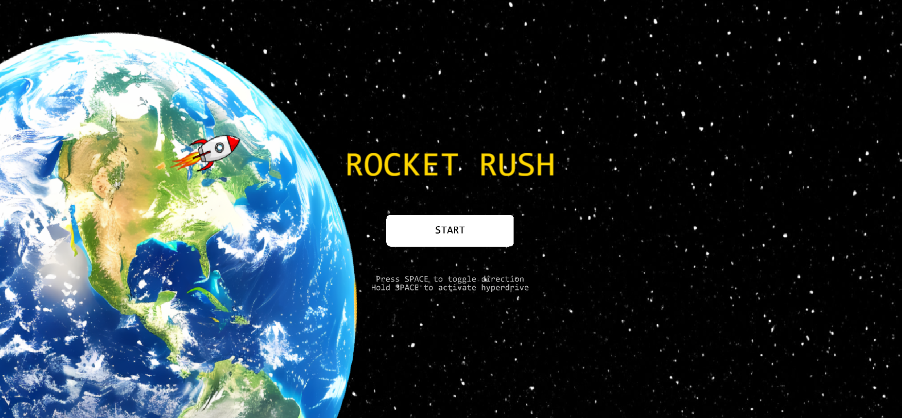

# Rocket Rush

A fast-paced, 2D arcade space-survival game built with JavaScript and the Kaplay game engine. Navigate your way through an asteroid field to make a safe touchdown on the moon!

## Demo

[Insert your hosting link here e.g., Netlify, Vercel, or GitHub Pages]

## Features

* Simple single-button flight controls where pressing space toggles your vertical direction
* Near Miss detection system
* Constantly moving background
* Start and Victory Screens (made using Kaplay scenes)

## Controls

 SPACE (Tap) - Toggle vertical flight direction (Up / Down) 
 SPACE (Hold) - Activates Hyperdrive (High Speed) 